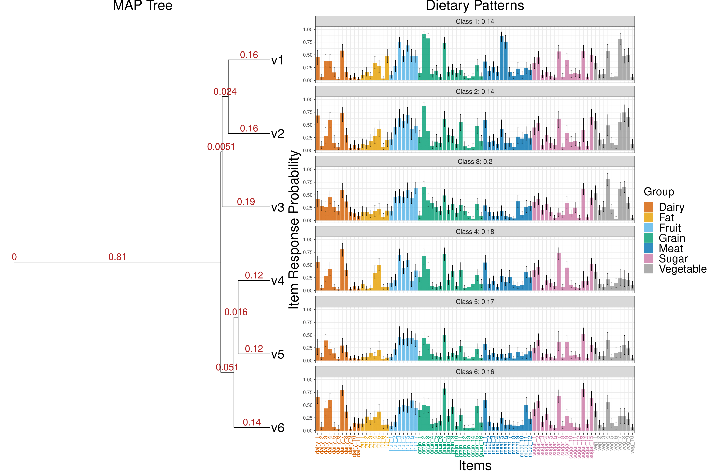

**ddtlcm**: Dirichlet diffusion tree-latent class model (DDT-LCM)

An R package for Tree-regularized Latent Class Models with a DDT process prior on class profiles

**Maintainer**: Mengbing Li, mengbing@umich.edu


<!-- **References**: If you are using **lotR** for tree-integrative latent class analysis, 
please cite the following preprint:
 -->

<!-- |       | Citation     | Paper Link
| -------------  | -------------  | -------------  |
| Bayesian tree-integrative LCM    | Li M, Park D, Aziz M, Liu CM, Price L, Wu Z (2021). Integrating Sample Similarity Information into Latent Class Analysis: A Tree-Structured Shrinkage Approach. *Biometrics*.   |[Link](https://onlinelibrary.wiley.com/doi/abs/10.1111/biom.13580)| 
 -->

## Table of content
- [1. Installation](#id-section1)
- [2. Overview](#id-section2)
- [2. Example](#id-section3)

<div id='id-section1'/>

Installation
--------------
```r
# install bioconductor package `ggtree` for visualizing results:
if (!require("BiocManager", quietly = TRUE))
    install.packages("BiocManager")
BiocManager::install("ggtree")

install.packages("devtools",repos="https://cloud.r-project.org")
devtools::install_github("limengbinggz/ddtlcm_package")
```


<div id='id-section2'/>

Overview
----------
`ddtlcm` is designed for analyzing multivariate binary observations over grouped items in a tree-regularized Bayesian LCM framework. Between-class similarities are guided by an unknown tree, where classes positioned closer on the tree are more similar _a priori_. This framework facilitates the sharing of information between classes to make better estimates of parameters using less data. The model is built upon equipping LCMs with a DDT process prior on the class profiles, with varying degrees of shrinkage across major item groups. The model is particularly promising for addressing weak separation of latent classes when sample sizes are small. The posterior inferential algorithm is based on 
a hybrid Metropolis-Hastings-within-Gibbs algorithm and can provide posterior uncertainty quantifications.


**ddtlcm** works for 

* multivariate binary responses over pre-specified grouping of items


* The functions' relations in the package `lotR` can be visualized by

```r
library(DependenciesGraphs) # if not installed, try this-- devtools::install_github("datastorm-open/DependenciesGraphs")
library(QualtricsTools) # devtools::install_github("emmamorgan-tufts/QualtricsTools")
dep <- funDependencies('package:ddtlcm','ddtlcm_fit')
plot(dep)
```


<div id='id-section3'/>

Examples 
---------

* A simple workflow using semi-synthetic data is provided in 

* *ddtlcm* estimates the tree over classes and class profiles simultaneously 


